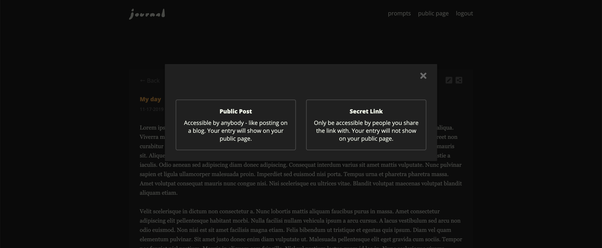

# Private Journal

## About

In a nutshell: a private online journal. A more stripped down version of https://penzu.com (and you really own your data
since you deploy your own instance).

This project is an attempt to make myself journal more
consistently. I find it much easier to gather my thoughts
with a keyboard. Having an online journal also means that
I don't need to remember to bring it with me everywhere. The app
is meant to be used by 1 person, and you can host easily your own instance.

## Features

- Basic CRUD for journal entries with a tagging
system to categorize/search for entries
- Sharing via secret link, or public post (like a blog). Access can be
revoked at any time.
- [SECURITY] Even though it is a 1 user app, you still set up a login with a username and password (both are hashed).
- [SECURITY] All journal entries/titles/tags/tokens are encrypted at the database level using
[OpenSSL::Cipher](https://ruby-doc.org/stdlib-2.4.0/libdoc/openssl/rdoc/OpenSSL/Cipher.html).
- [SECURITY] Email alert when a login occurs (if you want).

## Hosting your own

I'd recommend using [Heroku](https://heroku.com) since it's super simple to deploy a
Rails app and set up a SendGrid mailer.

### Set up environment variables

###### Required:
- `CIPHER_KEY`: Secret key used in encrypting. It needs to be 32 bytes base 64 encoded.
  - `Base64.encode64(SecureRandom.random_bytes(32))`.
- `TAG_CIPHER_IV`: This is to make sure tag IVs are
the same so that we can search on them. It needs to be 16 bytes base 64 encoded.
  - `Base64.encode64(SecureRandom.random_bytes(16))`.
- `SHARING_TOKEN_CIPHER_IV`: This is to make sure sharing token IVs are
the same so we can find posts from a public route parameter. It needs to be 16 bytes base 64 encoded.
  - `Base64.encode64(SecureRandom.random_bytes(16))`.

###### For login email alerts:
- `ALERT_EMAIL_RECIPIENT`: Where the alert gets sent to. If this
is missing, emailing will be skipped.
- `SENDGRID_USERNAME`: This is provided by Heroku with the SendGrid add-on.
- `SENDGRID_PASSWORD`: This is provided by Heroku with the SendGrid add-on.
- `MAILER_DOMAIN`: E.g. `"https://example.herokuapp.com"`

### Create a user

- Via Rails console: `User.create!(username: "...", password: "...")`
  - If you ever need to change your username/password: `User.first.update!(username: "...", password: "...")`

That's it! You're good to go.

## Usage and feedback
Feel free to use this however you'd like! If you use this, credit
would be nice but I don't really care that much. I'm primarily maintaining
this for my own use cases. But...if you have features you'd like to see built, or changes
that you think should be made, please open issues on this repo and tag me in them!
I'd love to improve the tool from your feedback.
